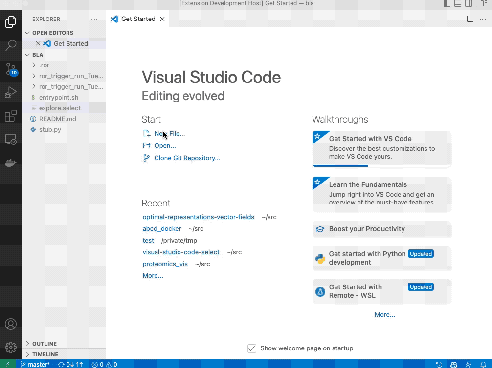
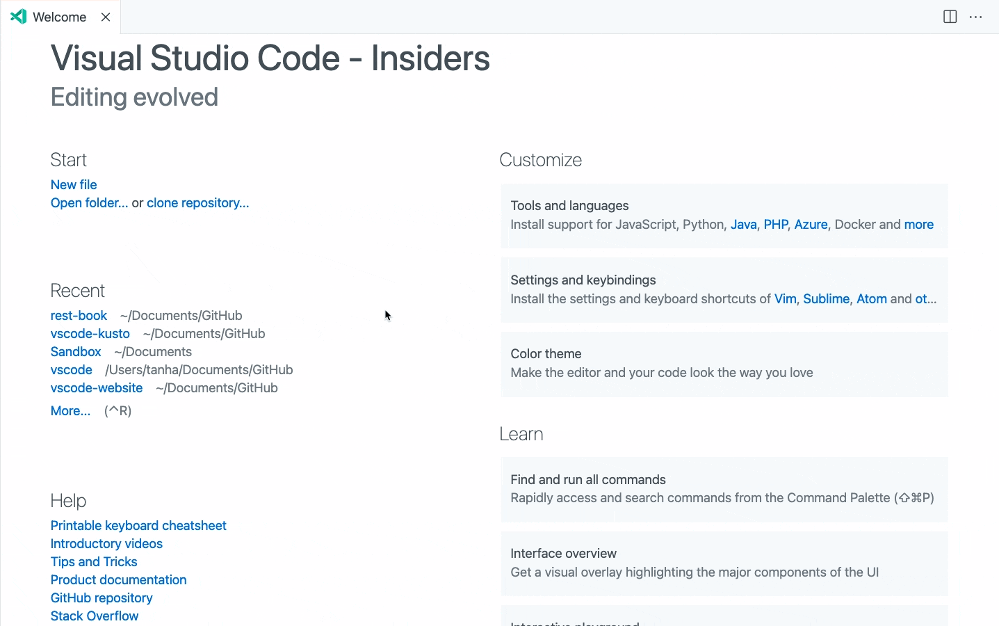

# Select Book

This Visual Studio Code extension is based on <https://github.com/tanhakabir/rest-book.git>.

## Features

- Create and run REST Calls within cells.
- Organize multiple REST Calls within one file.
- Intermingle markdown for documenting your calls.
- View rich HTML and image responses directly inside the Notebook.
- Optionally use the Interactive Window interface.
- Basic Authentication.
- Use data from one call in the next.
- Save API keys and other sensitive information outside of the Notebook to use securely in calls.

## Requirements

Must be using the latest version of Visual Studio Code Insiders edition.

## Usage

1. Create a new file to store your REST Calls with a `.select` ending.

You can also use the command: `Select Book: Create a new blank Select Notebook`.

1. Add a code cell by hovering over the middle of the Notebook and clicking the `+ Code`

To use the Interactive Window interface:

1. Run the command: `Select Book: Create an Interactive Window`
1. Enter your line(s) into the input field at the bottom of the window.
1. Click the adjacent button to run them.
1. Repeat.


## Variables

You can also assign the responses from calls to a variable and use the data from that response in future calls. To do this you would just declare a variable with `let` and the name of your variable and then a `=` like so:

```javascript
let foo = GET google.com
```

And then in future cells you can reference `foo` in your calls with a `$` sign.
